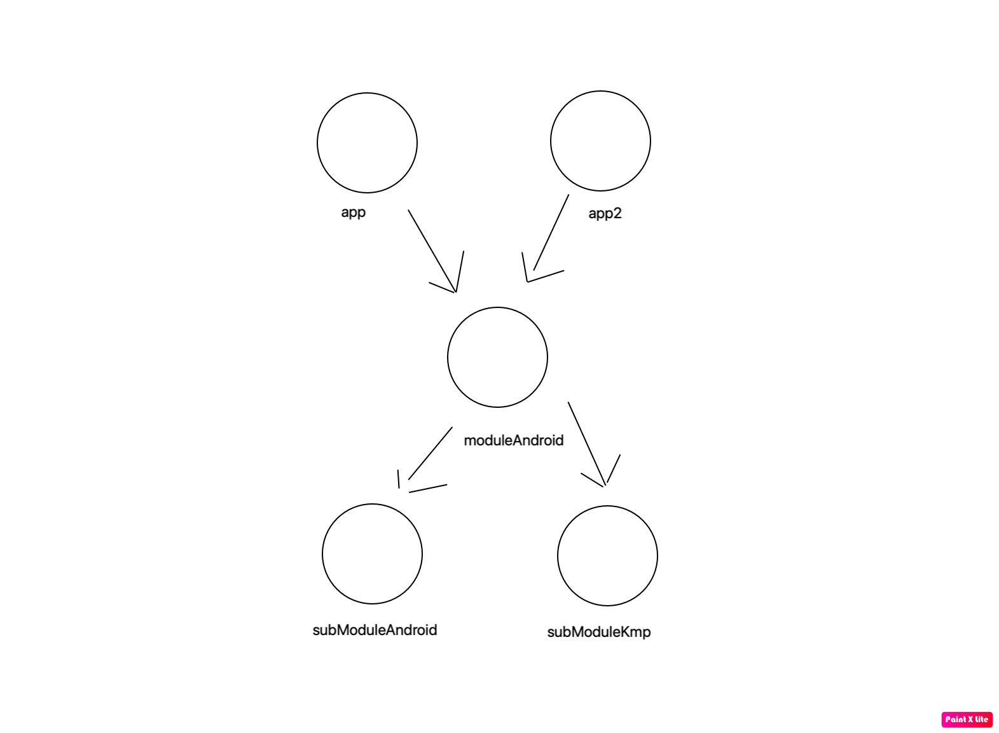
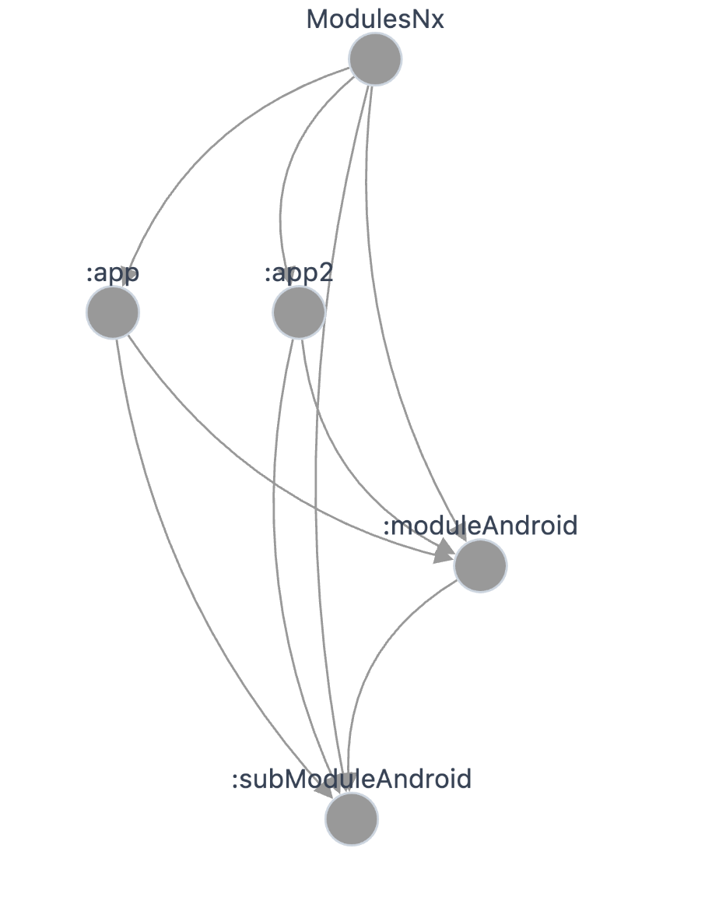

# Sample project Nx plugin

I made a simple android project with elements of kmp modules.

Here is the connection pattern as it should be (dependencies):

Here is the connection pattern that connects nx

## Problems
1. First problem is subModuleKmp is not visible, probably don't support plugin
`com.android.kotlin.multiplatform.library`
Ticket: https://github.com/nrwl/nx/issues/33155
2. Module dependencies subModuleAndroid\subModuleKmp should be only for moduleAndroid instead of also to app/app2.
Ticket: https://github.com/nrwl/nx/issues/33318
3. App & App2 should be visible as an Application (we can recognize it by the `com.android.application`), ModulesNx is a just project name - it is not a application.
Ticket: https://github.com/nrwl/nx/issues/33319
4. Maybe this is a wishlist, it would be great if the plugin could recognize the target of a given module (whether it is an Android, JVM, iOS or JS module) - with many modules it is easier to check the module migration process. 
Ticket: https://github.com/nrwl/nx/discussions/33320